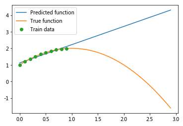

# Homework 4

Lingfeng Zhao

LZ1973

## 2.

```python
import numpy as np
from sklearn.linear_model import LinearRegression
from sklearn.model_selection import train_test_split
from sklearn.metrics import r2_score

utr, uts, ytr, yts = train_test_split(u, y, test_size=0.5)
dtest = range(1, 11)

rss = []
for i in dtest:
    x_tr = []
    x_ts = []
    for j in range(i + 1):
       x_tr.append(np.exp(-j/i * utr)) 
       x_ts.append(np.exp(-j/i * uts)) 
        
    X = np.concatenate(x_tr, axis=1)
    Xts = np.concatenate(x_ts, axis=1)
    
    model = LinearRegression() 
    model.fit(X, ytr) # Fits a linear model for a data matrix X 
    yhat = model.predict(Xts) # Predicts values

    rsq = r2_score(yts, yhat, multioutput='uniform_average')
    print(f"R^2 is {rsq}")
    rss.append(rsq)

order = np.argmin(rss) + 1
print(f"Model with lowest r^2 is {order}")
```

## 3.

### (a)

The training data has no noise: $y_i = f(x_i,\beta_0)$.
$$
\begin{align}
    Bias(x) &= \mathbb{E}(f(x,\hat{\beta})) - f(x,\beta_0) \\
            &= \mathbb{E}(\hat{\beta}x^2) - f(x,\beta_0)\\
            &= \mathbb{E}(\frac{\Sigma{y_i}}{\Sigma{x_i^2}}x^2) - f(x,\beta_0)\\       
            &= \mathbb{E}(\frac{\Sigma{y_i}}{\Sigma{x_i^2}})x^2 - f(x,\beta_0)\\
            &= \beta_0x^2 - \beta_0x^2\\
            &= 0
\end{align}
$$

### (b)

 The training data is $y_i = f(x_i,\beta_0) + \epsilon_i$ where the noise is i.i.d.  $\epsilon_i \sim {\mathcal N}(0,\sigma^2)$.
$$
\begin{align}
    Bias(x) &= \mathbb{E}(f(x,\hat{\beta})) - f(x,\beta_0) \\
            &= \mathbb{E}(\hat{\beta}x^2) - f(x,\beta_0)\\
            &= \mathbb{E}(\frac{\Sigma{y_i}}{\Sigma{x_i^2}}x^2) - f(x,\beta_0)\\       
            &= \mathbb{E}(\frac{\Sigma{\beta_0 x_i^2 +\epsilon_i}}{\Sigma{x_i^2}})x^2 - f(x,\beta_0)\\
            &= \beta_0x^2 - \beta_0x^2\\
            &= 0
\end{align}
$$

### (c)

The training data is $y_i = f(x_i+\epsilon_i,\beta_0)$ where the noise is i.i.d.  $\epsilon_i \sim {\mathcal N}(0,\sigma^2)$.
$$
\begin{align}
    Bias(x) &= \mathbb{E}(f(x,\hat{\beta})) - f(x,\beta_0) \\
            &= \mathbb{E}(\hat{\beta}x^2) - f(x,\beta_0)\\
            &= \mathbb{E}(\frac{\Sigma{y_i}}{\Sigma{x_i^2}}x^2) - f(x,\beta_0)\\       
            &= \mathbb{E}(\frac{\Sigma{\beta_0 (x_i +\epsilon_i)^2}}{\Sigma{x_i^2}})x^2 - f(x,\beta_0)\\
            &= \beta_0\mathbb{E}(\frac{\Sigma{x_i^2 +\epsilon_i^2 + 2x_i\epsilon}}{\Sigma{x_i^2}})x^2 - f(x,\beta_0)\\
            &= \beta_0(1 + \frac{\sigma^2}{\Sigma{x_i^2}} + 0 )x^2 - \beta_0x^2\\
            &= \frac{\sigma^2 \beta_0}{\Sigma{x_i^2}}
\end{align}
$$


## 4.

### (a)

This is a normal regression question. We can get the result:
$$
\hat{\beta} = \arg \min_\beta \Sigma_{i=1}^N(y_i - (\beta_0 + \beta_1x_i))^2
$$

### (b)

The same as (a)
$$
\hat{\beta} = \arg \min_\beta \Sigma_{i=1}^N(\beta_{00} +\beta_{01}x_i +\beta_{02}x_i^2 - (\beta_0 + \beta_1x_i))^2
$$

### (c)

```python
import numpy as np
from matplotlib import pyplot as plt
beta_0 = [-1, 2, 1]

x = np.arange(0, 1, 0.1)
y = np.polyval(beta_0, x)

beta_hat = np.polyfit(x, y, 1)
x_plot = np.arange(0, 3, 0.1)
y_pred = np.polyval(beta_hat, x_plot)
y_true = np.polyval(beta_0, x_plot)
plt.plot(x_plot, y_pred)
plt.plot(x_plot, y_true)
plt.plot(x, y, 'o')
plt.legend(['Predicted function', 'True function', 'Train data'])
plt.show()
```



### (d)

When x = 3.

## 5

### (a)

Let us define $x_1 := cancer\space volume$, $x_2 := age$, $x_3 := if\ a\ cancer\ is\ Type 1 $

Model 1:
$$
\hat{y} = \beta_0 +\beta_1x_1
$$
Model 2:
$$
\hat{y} = \beta_0 +\beta_1x_1 + \beta_2x_2
$$


Model 3:
$$
\hat{y} = \beta_0 +\beta_1x_1x_3 +\beta_2x_1(1-x_3) + \beta_3x_2
$$

### (b)

From Model 1 to Model 3, there are respectively 2, 3 and 4 parameters. Model 3 is the most complicated one.

### (c)

Model 1:
$$
\bf{A} = \begin{bmatrix}
1&0.7\\
1&1.3\\
1&1.6\\
\vdots&\vdots
\end{bmatrix}
$$
Model 2:
$$
\bf{A} = \begin{bmatrix}
1&0.7&55\\
1&1.3&65\\
1&1.6&70\\
\vdots&\vdots&\vdots
\end{bmatrix}
$$
Model 3:
$$
\bf{A} = \begin{bmatrix}
1&0.7&0&55\\
1&0&1.3&65\\
1&0&1.6&70\\
\vdots&\vdots&\vdots&\vdots
\end{bmatrix}
$$

### (d)

$SE = std RSS/\sqrt{K -1}$. For three model, Model 3 has the least RSS 0.7, so $SE = 0.05/\sqrt{10 -1} \approx 0.0167 $. We get the RSS target of $0.7 + 0.0167 = 0.7167$. Only Model 3 is less than this target. So we choose  model 3.

