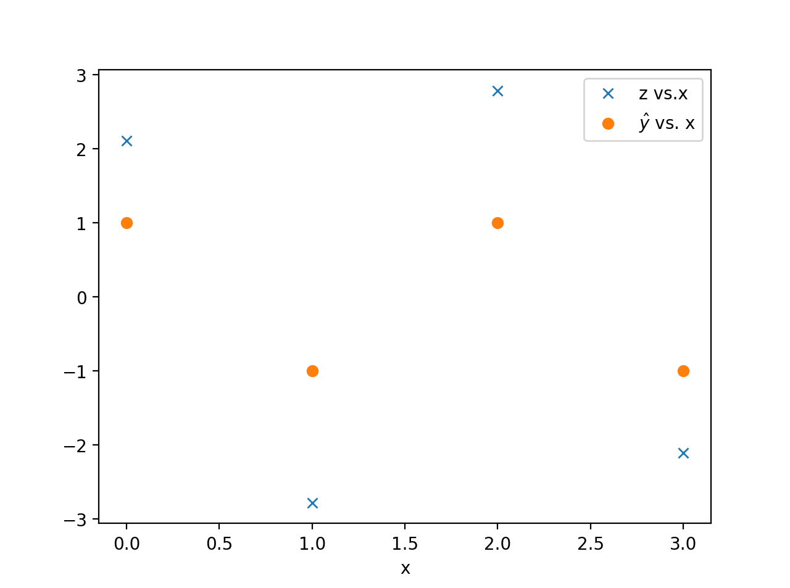

# Homework 8

Lingfeng Zhao

LZ1973

## 1

### (a) 

Let $b = -0.5$, $w_1 = 0$, $w_2=1$. So the classifier is
$$
\hat{y} = 
		\begin{cases}
            1 & \mbox{if } -0.5 + x_2 > 0 \\
            -1 & \mbox{if } -0.5 + x_2 < 0
        \end{cases}
$$

### (b)

In this case, we let $\gamma = 0.2$, so for all of the $x_i$ and $y_i$ , $y_i(b+w_1x_{i1} + w_{i2}x_{i2}) \geq \gamma, \mbox{ for all } i,$.

### (c)

$$
\|\mathbf{w} \|= \sqrt{ w_1^2 + w_2^2 } = \sqrt{(-0.5)^2} = 0.5\\
m = \frac{\gamma}{\|\mathbf{w}\|} = 0.4
$$

### (d)

Samples $2\ and\ 3$ are on the margin.

## 2

### (a)

```python
import numpy as np
from matplotlib import pyplot as plt

x = np.fromstring("0 1.3 2.1 2.8 4.2 5.7", sep=' ')
y = np.fromstring("-1 -1 -1 1 -1 1", sep=' ')


t = np.linspace(0, 5, 100)[:, None]
z = x - t
y_hat = np.where(z > 0, 1, -1)

J = np.sum(np.maximum(0, 1 - y*z), axis=1)

plt.figure(dpi=200)
plt.plot(t, J)
plt.xlabel('t')
plt.ylabel('J(t)')
plt.show()
```


### (b)

When t is form 3.13131313 to 4.6969697, $J(t)$ will reach its minimum 3.4

### (c)

We set t to 4, so the corresponding $\epsilon_i = [0 , 0 , 0, 2.2, 1.2, 0 ]​$ 

### (d)

The 4th and 5th sample (2.8, 4.2) are misclassified as well as violate the margin. 

## 3

### (a)

$\mathbf x = [0,0,0,0,0,0,1,0,0,0,1,0,0,0,1,0]​$ 

$\mathbf w= [0,0,0,0,0,1,1,0,0,1,1,0,0,0,0,0]$

### (b)

$z = \mathbf w^\intercal \mathbf x = 2​$

### (c)

$$
    \mathbf X_{right} = \left[
        \begin{array}{cccc}
        0 & 0 & 0 & 0 \\
        0 & 0 & 0 & 1 \\
        0 & 0 & 0 & 1 \\
        0 & 0 & 0 & 1 
        \end{array} \right], \quad
$$

$\mathbf x_{right} = [0, 0, 0, 0, 0, 0, 0, 1, 0, 0, 0, 1, 0, 0, 0, 1]​$.

Thus $z = \mathbf w^\intercal \mathbf x_{right} = $ 2

### (d)
$$
\mathbf X_{left} = \left[
        \begin{array}{cccc}
         0 & 0 & 0 & 0 \\
         0 & 1 & 0 & 0 \\
         0 & 1 & 0 & 0 \\
         0 & 1 & 0 & 0 
        \end{array} \right], \quad
$$

$\mathbf x_{left} = [0, 0, 0, 0, 0, 1, 0, 0, 0, 1, 0, 0, 0, 1, 0, 0]$.

Thus $z = \mathbf w^\intercal \mathbf x_{left} = $ 2

### (e)

```python
x = Xmat.flatten()
Xmat = x.reshape(4, 4)
```

## 4

### (a)

```python
import numpy as np
from matplotlib import pyplot as plt

gamma = 3 
alpha = np.array([0 ,0 , 1, 1])
x = np.array([0, 1, 2, 3])
y = np.array([1, -1, 1, -1])

z = np.sum(alpha * y * np.exp(- gamma* (x -x[:,None])**2), axis =0)
y_hat = np.where(z > 0, 1, -1)

plt.figure(dpi=200)
plt.plot(x, z, 'x')
plt.plot(x, y_hat, 'o')
plt.legend(["z vs.x", "$\hat{y}$ vs. x"])
plt.xlabel('x')
plt.show()
```


### (b)

```python
import numpy as np
from matplotlib import pyplot as plt

gamma = 0.3 
alpha = np.array([1 ,1 , 1, 1])
x = np.array([0, 1, 2, 3])
y = np.array([1, -1, 1, -1])

z = np.sum(alpha * y * np.exp(- gamma* (x -x[:,None])**2), axis =0)
y_hat = np.where(z > 0, 1, -1)

plt.figure(dpi=200)
plt.plot(x, z, 'x')
plt.plot(x, y_hat, 'o')
plt.legend(["z vs.x", "$\hat{y}$ vs. x"])
plt.xlabel('x')
plt.show()
```



### (c)

From those two plots the first classifier makes more error (1 error ) , the second make 0 errors.

